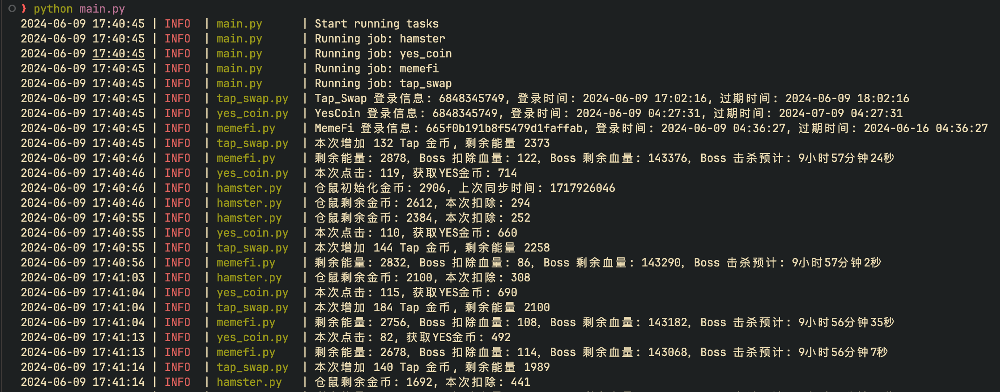

# TON Game

## 描述

`Ton` 游戏挂机助手，释放双手。

* 仅用于辅助在线，不能完全一劳永逸。
* 需要有一定的抓包基础，获取 `token` 信息。




## 工具

1. 需要配合依赖抓包工具，获取当前登录的 `cookie` 认证信息。
2. 抓包工具 `Charles`、`Fiddler`、`Wireshark` 等，获取请求 `headers` 中的 `Authorization` 信息。
3. 支持 `Telegram` 网页端玩的游戏，可以在浏览器中查看请求 `headers` 中的 `Authorization` 信息。

## 本地使用

1. 修改配置文件 `config.toml`，中的信息，根据当前的游戏项目进行配置。
2. `pip install -r requirements.txt` 安装依赖。
3. 运行 `python3 main.py` 开始挂机。

## `Docker` 运行
1. `docker pull python:latest`
2. `docker run -itd --name game_bot -v "$(pwd)":/app python`
3. `docker exec -it game_bot bash`
4. `cd /app`
5. `pip3 install -r requirements.txt`
6. `python3 main.py`


### 配置文件解析

```toml
[client]
ua = "" # 当前所有游戏使用的 User-Agent，建议使用移动端的 User-Agent

[game]
[game.hamster]
enabled = true # 是否开启游戏
token = "" # 当前帐号 Authorization 信息，每种游戏的 `token` 有效期不同
capacity = 5000 # 当前游戏体力恢复上限
recovery_seconds = 3 # 每秒恢复的体力值
click_one = 7 # 单次点击屏幕扣掉的体力值
click_interval = [30, 70] # 每次请求点击的数量，每次扣掉的总体力 = click_one * click_interval
sleep_interval = [7, 10] # 每次请求间隔时间
```

---

# 支持游戏项目

* [YesCoin](https://t.me/theYescoin_bot/Yescoin?startapp=nVhaIO)
* [Hamster Kombat](https://t.me/hamsteR_kombat_bot/start?startapp=kentId6848345749)
* [MemeFi](https://t.me/memefi_coin_bot?start=r_9a7a1353be)
    - [x] 支持击杀 `Boos` 自动升级跳入下一关
    - [x] 支持定时挂机收益
* [TapSwap](https://t.me/tapswap_bot?start=r_6848345749)

欢迎沟通新的游戏项目，会尽快支持，加入群聊 [telegram](https://t.me/ton_game_coin)。

---

# 免责声明

* 使用插件有风险，使用需谨慎。
* 本项目仅用于娱乐，不可用于商业和个人其他意图。若使用不当，请使用者自行承担。
* 如有侵权，请联系本人 [telegram](https://t.me/kelegm)。
